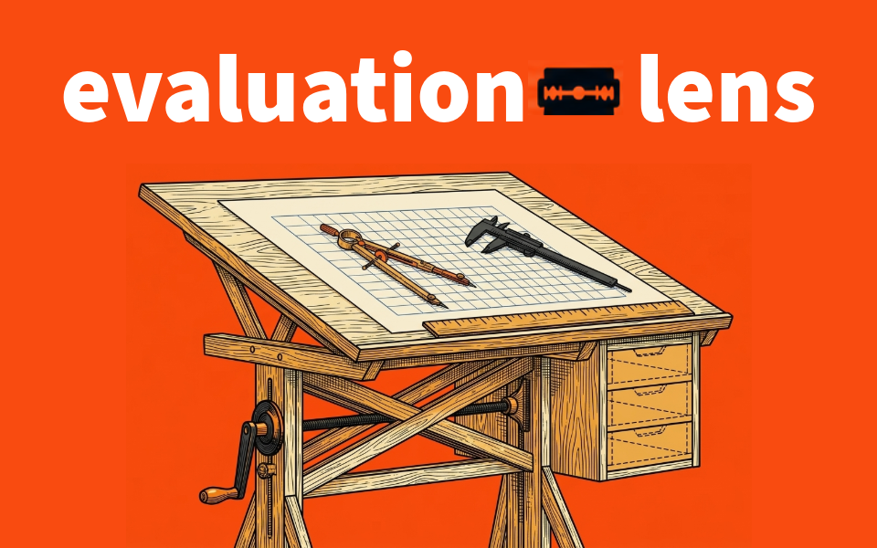
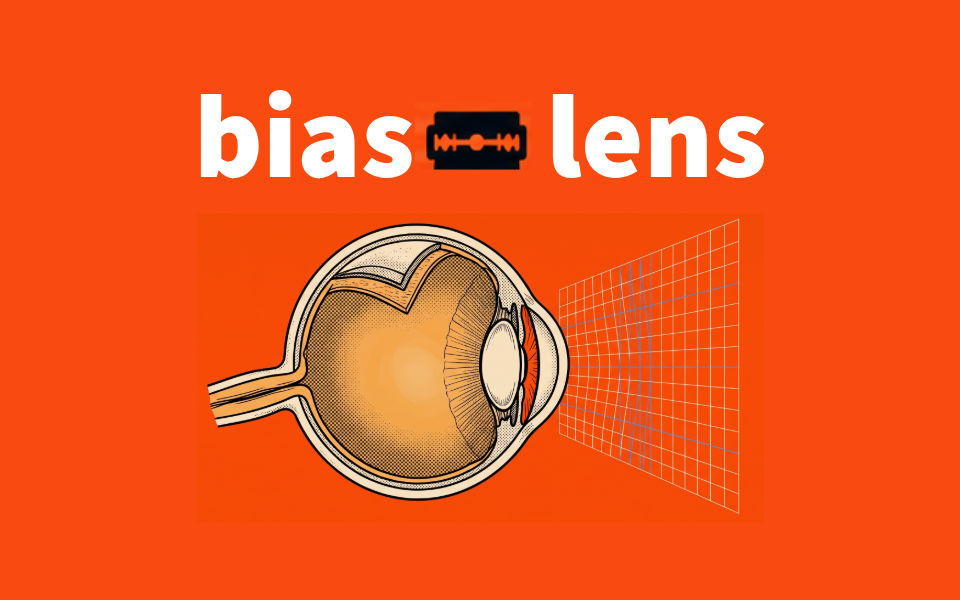
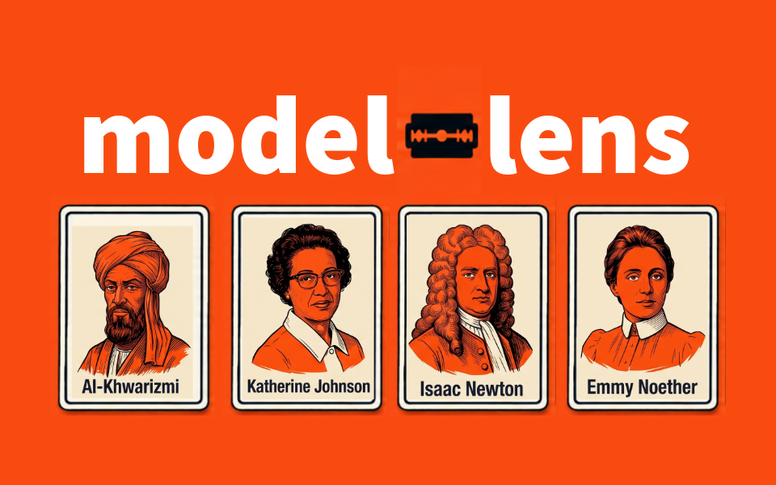
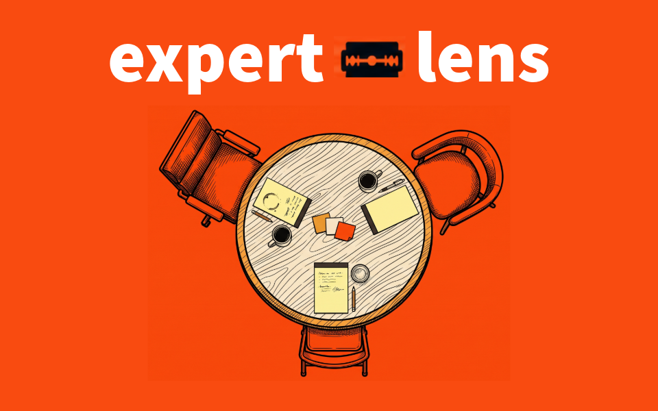
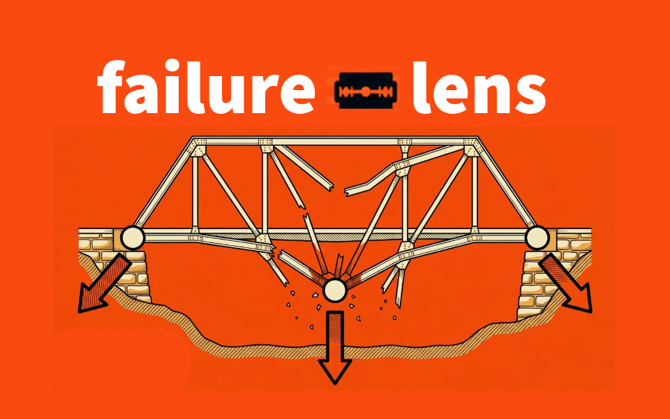
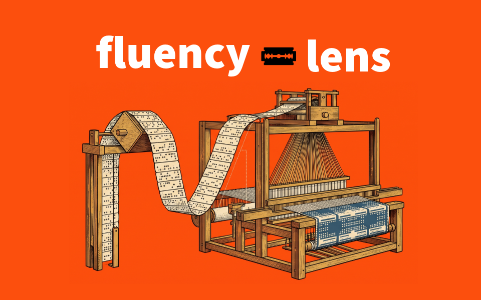
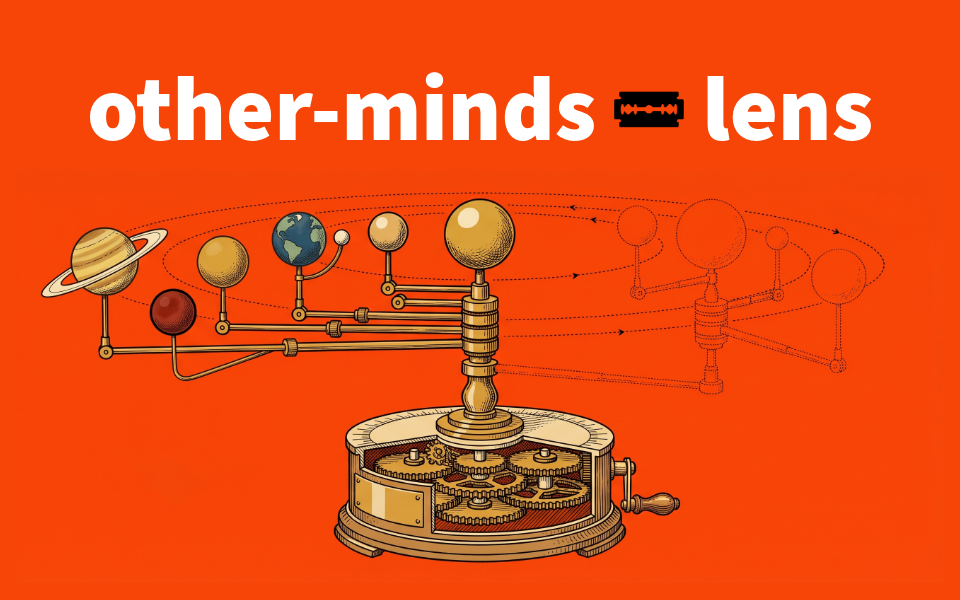

## AI cannot decide which problems should matter to us. That part stays human.

There is value in choosing a problem, struggling with it, seeing it from different angles, and working toward an answer.

That process is not something to automate. **It is one of the best ways we learn.**

**OCCAMI [NOVACULA](https://academic.oup.com/brain/article/145/6/1870/6575832) is a growing suite of AI Skills built to support that struggle.**

The Skills shared here do not solve our problems for us. They help us think differently about them.

We question assumptions. Change perspectives. Expose disagreements. Generate alternatives. Find a place to begin.

**But simplicity is only one lens.**

Sometimes we ask the wrong question. Sometimes we miss another perspective. Sometimes two reasonable ways of thinking lead to different places. Sometimes what matters most is the thing we have not thought to ask.

## Why [NOVACULA](https://doi.org/10.1093/brain/awac159)?

A razor can cut things away. A scribe's *novacula* did something more interesting: it made revision possible.

Medieval writers used scraping knives to remove mistakes from parchment and continue the work. A 2022 essay in *Brain* proposes this as another way to understand Ockham's razor: not as a call for simplicity, but as a tool for updating, amending, and evaluating ideas.

That interpretation fits OCCAMI.

The goal is not always to make a problem simpler. It is to question, revise, reframe, and improve how we are thinking about it.

**[Read the essay →](https://doi.org/10.1093/brain/awac159)**

## Skills

<table>
<tr>
<td width="42%" valign="top">
  
</td>
<td width="58%" valign="top">
  <h3><a href="https://github.com/davehallmon/reasoning-lens">reasoning-lens</a></h3>
  
<strong>How should I think about this?</strong>

  
Seven philosophical methods examine one idea and surface the disagreements that matter.

</td>
</tr>
<tr>
<td width="42%" valign="top">
  
</td>
<td width="58%" valign="top">
  <h3><a href="https://github.com/davehallmon/problem-lens">problem-lens</a></h3>
  
<strong>What should I do about this?</strong>

  
Multiple problem-solving lenses generate ranked options and identify a place to begin.

</td>
</tr>
</table>

### Planned

Not built yet, and the names may change. Each one has to pass the same test before it ships: **does it help you revise your thinking, or does it only tell you that you are wrong?** If it only does the second, it becomes a mode inside an existing Skill, not a new one.

<table>
<tr>
<td width="42%" valign="top">
  
</td>
<td width="58%" valign="top">
  <h3>evaluation-lens</h3>
  
<strong>How good is this draft, and how would I improve it?</strong>

  
Freezes your draft, scores it against a rubric built from your purpose, and hands you a revision roadmap before it changes a word.

</td>
</tr>
<tr>
<td width="42%" valign="top">
  
</td>
<td width="58%" valign="top">
  <h3>bias-lens</h3>
  
<strong>What is steering my thinking?</strong>

  
Flags the biases a situation invites, and says plainly when it finds none.

</td>
</tr>
<tr>
<td width="42%" valign="top">
  
</td>
<td width="58%" valign="top">
  <h3>model-lens</h3>
  
<strong>Which mental model fits, and where does it stop working?</strong>

  
Matches your situation to a mental model, labels what kind of claim it is (law, regularity, heuristic, metaphor), and warns when you stretch it too far.

</td>
</tr>
<tr>
<td width="42%" valign="top">
  
</td>
<td width="58%" valign="top">
  <h3>expert-lens</h3>
  
<strong>How would experts who disagree argue this?</strong>

  
Three archetypes cross-examine one idea.

</td>
</tr>
<tr>
<td width="42%" valign="top">
  
</td>
<td width="58%" valign="top">
  <h3>failure-lens</h3>
  
<strong>How might this fail?</strong>

  
Assumes the plan has already collapsed and traces the internal causes back to today's decisions.

</td>
</tr>
<tr>
<td width="42%" valign="top">
  
</td>
<td width="58%" valign="top">
  <h3>fluency-lens</h3>
  
<strong>Is the way I work with AI ready for what comes next?</strong>

  
Audits an AI-assisted workflow against six Ds and sets a 30-day change.

</td>
</tr>
<tr>
<td width="42%" valign="top">
  
</td>
<td width="58%" valign="top">
  <h3>other-minds-lens</h3>
  
<strong>How would someone with different incentives see this?</strong>

  
Reasons from another party's incentives, information, and constraints. Optional, and built last.

</td>
</tr>
</table>

fluency-lens builds on the four Ds of the [AI Fluency Framework](https://aifluencyframework.org/) by Rick Dakan and Joseph Feller, developed with Anthropic: Delegation, Description, Discernment, and Diligence. It adds two: Data Decisions and Development.

### How the Skills fit together

You choose the problem. You use whichever lenses help, in any order, and you can return to the struggle as often as you need. No Skill decides for you. Dashed Skills are planned, not built.

### What these Skills can't judge

A lens focuses, and it also narrows. Each published Skill says what its lens cannot see. None of them can judge taste: whether a design, a sentence, or an argument feels right. They can show what a draft does. What it should be stays with you.

## Building in public

A small snapshot of the work behind the ideas.

<picture>
  
</picture>

---

## Let's discover our unknown unknowns together.

Ideas, criticism, experiments, and contributions are welcome.

