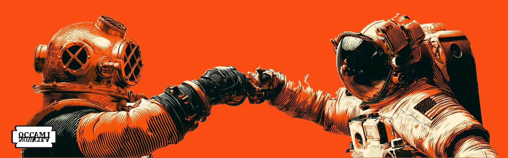
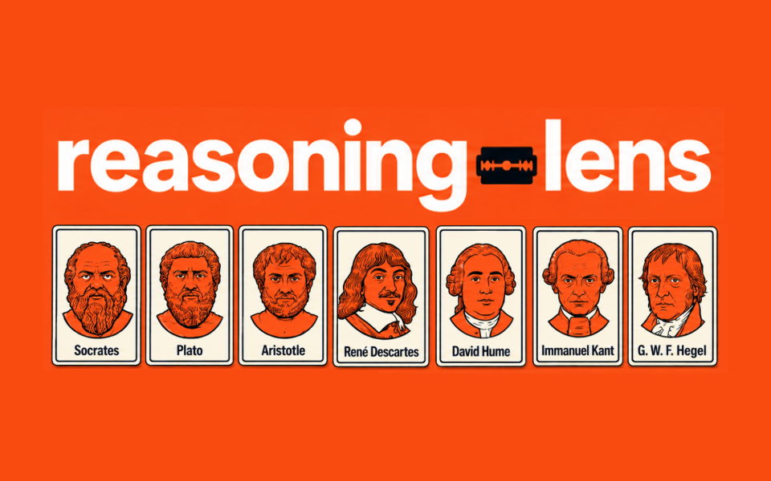
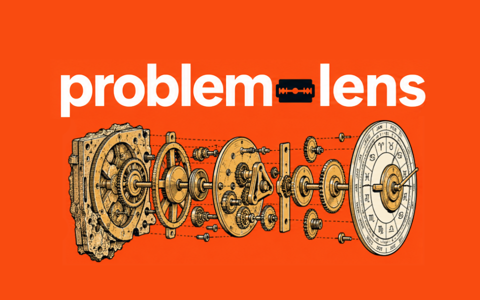

## AI cannot decide which problems should matter to us. That part stays human.

There is value in choosing a problem, struggling with it, seeing it from different angles, and working toward an answer.

That process is not something to automate. **It is one of the best ways we learn.**

**OCCAMI [NOVACULA](https://academic.oup.com/brain/article/145/6/1870/6575832) is a growing suite of AI Skills built to support that struggle.**

The Skills shared here do not solve our problems for us. They help us think differently about them.

We question assumptions. Change perspectives. Expose disagreements. Generate alternatives. Find a place to begin.

**But simplicity is only one lens.**

Sometimes we ask the wrong question. Sometimes we miss another perspective. Sometimes two reasonable ways of thinking lead to different places. Sometimes what matters most is the thing we have not thought to ask.

## Why [NOVACULA](https://doi.org/10.1093/brain/awac159)?

A razor can cut things away. A scribe's *novacula* did something more interesting: it made revision possible.

Medieval writers used scraping knives to remove mistakes from parchment and continue the work. A 2022 essay in *Brain* proposes this as another way to understand Ockham's razor: not as a call for simplicity, but as a tool for updating, amending, and evaluating ideas.

That interpretation fits OCCAMI.

The goal is not always to make a problem simpler. It is to question, revise, reframe, and improve how we are thinking about it.

**[Read the essay →](https://doi.org/10.1093/brain/awac159)**

## Skills

<table>
<tr>
<td width="42%" valign="top">
  
</td>
<td width="58%" valign="top">
  <h3><a href="https://github.com/davehallmon/reasoning-lens">reasoning-lens</a></h3>
  
<strong>How should I think about this?</strong>

  
Seven philosophical methods examine one idea and surface the disagreements that matter.

</td>
</tr>
<tr>
<td width="42%" valign="top">
  
</td>
<td width="58%" valign="top">
  <h3><a href="https://github.com/davehallmon/problem-lens">problem-lens</a></h3>
  
<strong>What should I do about this?</strong>

  
Multiple problem-solving lenses generate ranked options and identify a place to begin.

</td>
</tr>
</table>

## Building in public

A small snapshot of the work behind the ideas.

<picture>
  
</picture>

---

## Let's discover our unknown unknowns together.

Ideas, criticism, experiments, and contributions are welcome.

